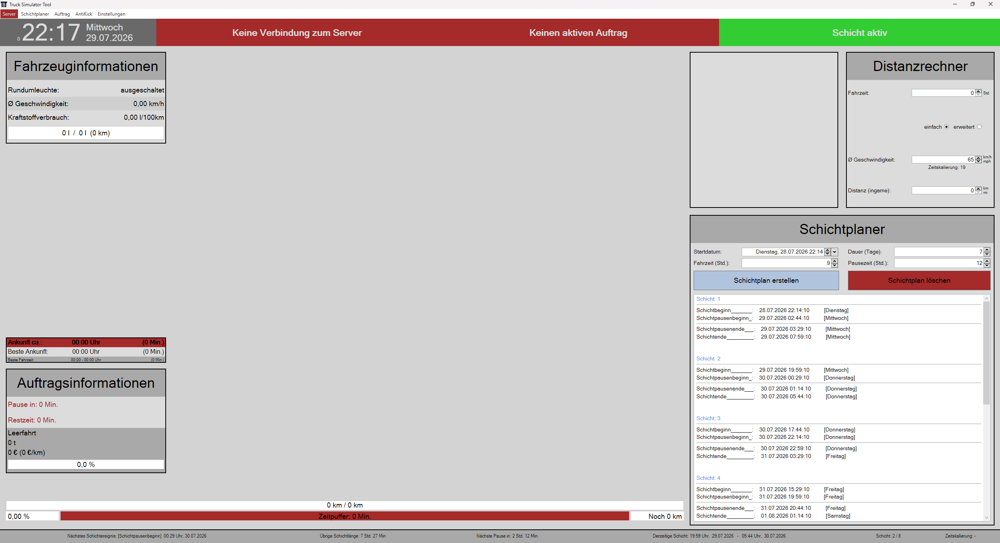

# Truck Simulator Tool [WPF]

Die **Truck Simulator Tool**-Anwendung ist eine in C# entwickelte WPF-Anwendung, die Telemetriedaten aus dem **Euro Truck Simulator 2 (ETS2)** und **American Truck Simulator (ATS)** auswertet und visualisiert. 

Das Tool liefert Live-Daten zu aktuellen Aufträgen, Ankunftszeiten sowie Fahrzeugwerten. Der integrierte Schichtenplaner ermöglicht zudem das Erstellen realistischer Schichtpläne für virtuelle LKW-Fahrer(-innen) und Speditionen.

 

> ℹ️ **Hinweis zur Telemetrie**
> 
> Für die Telemetriedaten wird das Telemtry-Plugin von SpedV genutzt ([https://www.spedv.de/](https://store.steampowered.com/app/839200/SpedV/)), welches die Daten über eine REST-API zur Verfügung stellt.

 

## 📌 Hauptfunktionen

* **Echtzeit-Telemetrie:**
  * Anzeige wichtiger Fahrzeugdaten wie Geschwindigkeit, Status der Rundumleuchten, Kraftstoffverbrauch und Tankinhalt.
  * Anzeige des Frachtnamens, Frachtgewicht und Preis der Fracht.
  * Vollautomatische Berechnung der geschätzten Ankunftszeit und der zu Auftragsbeginn geplanten besten Ankunftszeit.

* **Distanzrechner:**
  * Berechnung der möglichen zurücklegbaren Distanz bei einer bestimmten durchschnittlichen Geschwindigkeit.

* **Schichtplaner:**
  * Erstellen von realistischen Schichten, um den Alltag eines Berufskraftfahrers virtuell zu simulieren.

* **TruckersFM Integration:**
  * Live-Anzeige von Moderator, aktuellem Titel und Status des Online-Radiosenders TruckersFM.

* **Anti-Kick Funktion:**
  * (optionale) automatische Textnachrichten zur Vermeidung von AFK-Disconnects auf TruckersMP-Servern.

 

## 🛠️ Anforderungen & Build
* Telemetrie: [https://www.spedv.de/](https://store.steampowered.com/app/839200/SpedV/)
* Framework: .NET Framework / C#
* UI Framework: Windows Presentation Foundation (WPF)
* IDE: Visual Studio 2019 / 2022

 
